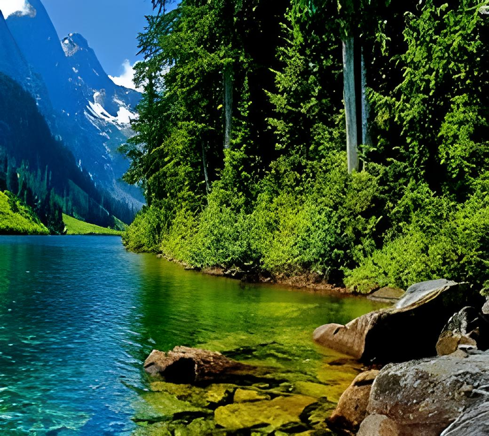

# ESRGAN Image Super-Resolution

This repository contains a FastAPI + PyTorch implementation of **ESRGAN / RRDBNet** for image super-resolution. Users can send a low-resolution image to the API, and the model will output a high-resolution version.

---

## Features
- FastAPI backend for serving the model via an API
- RRDBNet / ESRGAN model for upscaling images
- Simple Python script for testing single images
- Before/after image comparison

---

## Demo Images

**Low-Resolution (Input) vs Super-Resolution (Output)**

| Input | Output |
|-------|--------|
|  |  |

